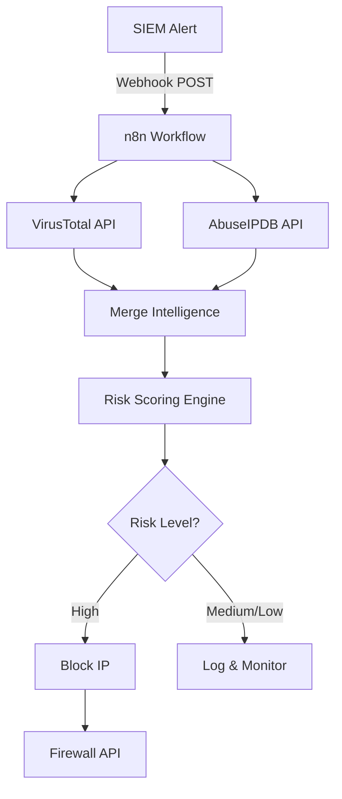

# 🛡️ Mini SOAR Platform
### AI-Powered Threat Detection & Automated Response System

[](https://opensource.org/licenses/MIT)
[](https://n8n.io)
[](https://www.docker.com/)
[](https://github.com/yourusername/mini-soar)

> **Transform security alerts into automated responses in under 4 seconds**  
> A production-grade SOAR demonstration built with n8n, threat intelligence APIs, and intelligent risk scoring.

---

## 🎯 What This Does

Imagine getting 100 security alerts per day. Each one takes 10-15 minutes to investigate manually. That's **16+ hours of repetitive work**.

This system does it **automatically in 4 seconds** per alert.

**Real-world workflow:**
```
Suspicious IP detected → Check threat databases → Calculate risk → Block if dangerous
```

**All automated. Zero human intervention.**

---

## ⚡ Quick Demo

```bash
# Send a test alert
curl -X POST http://localhost:5678/webhook/security-alert \
  -H "Content-Type: application/json" \
  -d '{"ip": "185.220.101.1", "event_type": "failed_login", "severity": "medium"}'

# System automatically:
# ✓ Checks VirusTotal (8 vendors flag as malicious)
# ✓ Checks AbuseIPDB (85% confidence score)
# ✓ Calculates risk: HIGH
# ✓ Blocks IP at firewall
# ✓ Logs everything

# Total time: 3.8 seconds
```

---

## 🏗️ Architecture



**Six-layer security automation:**
1. **Alert Ingestion** - Webhook receives security events
2. **Parallel Enrichment** - Query multiple threat intel sources simultaneously
3. **Data Normalization** - Combine responses into unified format
4. **Intelligent Scoring** - JavaScript-based risk calculation
5. **Smart Routing** - Conditional logic based on threat level
6. **Automated Response** - Block high-risk IPs instantly

---

## 🚀 Getting Started

### Prerequisites
- Ubuntu (or any Linux distro)
- Docker
- 10 minutes of your time

### Installation

**1. Install Docker**
```bash
sudo apt update && sudo apt upgrade -y
sudo apt install docker.io -y
sudo systemctl enable --now docker
```

**2. Deploy n8n**
```bash
docker run -d \
  --name n8n \
  -p 5678:5678 \
  -v ~/.n8n:/home/node/.n8n \
  n8nio/n8n
```

**3. Open n8n**
```
http://localhost:5678
```

**4. Get API Keys** (Free!)
- **VirusTotal:** [virustotal.com](https://www.virustotal.com) → 500 requests/day free
- **AbuseIPDB:** [abuseipdb.com](https://www.abuseipdb.com) → 1,000 requests/day free

**5. Import Workflow**
- Download `soar-workflow.json` from this repo
- In n8n: Import → Select file → Done

**6. Configure Credentials**
- Add VirusTotal API key (Header Auth: `x-apikey`)
- Add AbuseIPDB API key (Header: `Key` + `Accept: application/json`)

**7. Activate & Test**
```bash
# Activate workflow in n8n UI
# Send test alert (see Quick Demo above)
```

---

## 🔍 How It Works

### Component Breakdown

#### 1️⃣ **Webhook Trigger** 
Receives security alerts in JSON format:
```json
{
  "ip": "185.220.101.1",
  "event_type": "failed_login", 
  "severity": "medium"
}
```
*Simulates integration with Splunk, Wazuh, or any SIEM*

---

#### 2️⃣ **VirusTotal Enrichment**
```javascript
GET https://www.virustotal.com/api/v3/ip_addresses/{IP}

// Extracts:
malicious_count = 8    // 8 security vendors flagged this IP
reputation = -15       // Negative = bad actor
```

---

#### 3️⃣ **AbuseIPDB Enrichment**
```javascript
GET https://api.abuseipdb.com/api/v2/check?ipAddress={IP}

// Extracts:
abuse_score = 85       // 85% confidence it's malicious
total_reports = 127    // Reported 127 times by community
```

---

#### 4️⃣ **Risk Scoring Algorithm**
```javascript
// Intelligent risk classification
if (vtMalicious >= 5 || abuseScore >= 70) {
  risk = "high";        // Block immediately
} else if (vtMalicious >= 1 || abuseScore >= 30) {
  risk = "medium";      // Monitor closely  
} else {
  risk = "low";         // Log only
}
```

**Risk Matrix:**

| Malicious Detections | Abuse Score | Risk Level | Action |
|---------------------|-------------|------------|---------|
| ≥ 5 vendors         | OR ≥ 70%    | 🔴 High    | Block   |
| 1-4 vendors         | OR 30-69%   | 🟡 Medium  | Monitor |
| 0 vendors           | AND < 30%   | 🟢 Low     | Log     |

---

#### 5️⃣ **Conditional Routing**
```javascript
// Only high-risk threats trigger containment
if (risk === "high") {
  → Block at firewall
} else {
  → Log and continue monitoring
}
```

---

#### 6️⃣ **Automated Containment**
```bash
POST https://firewall-api.company.com/block
{
  "action": "block",
  "ip": "185.220.101.1",
  "risk": "high",
  "timestamp": "2025-02-09T14:30:00Z"
}
```
*Demo uses httpbin.org - replace with your actual firewall API*

---

## 🎓 What You'll Learn

Building this project teaches:

**Security Concepts:**
- ✅ SOAR platform architecture
- ✅ Threat intelligence correlation
- ✅ Risk-based decision making
- ✅ Incident response automation
- ✅ Defense in depth strategies

**Technical Skills:**
- ✅ n8n workflow orchestration
- ✅ REST API integration
- ✅ Parallel data processing
- ✅ JavaScript for security logic
- ✅ Docker containerization

**Professional Experience:**
- ✅ SOC analyst workflows
- ✅ Security automation design
- ✅ Production deployment thinking
- ✅ Documentation best practices

---

## 🔧 Extend This Platform

### Add Real Firewall Integration

**Ubuntu UFW:**
```bash
# SSH Execute Command node
ssh admin@firewall "sudo ufw deny from {{$json['ip']}}"
```

**AWS Security Groups:**
```javascript
// AWS node configuration
Action: AuthorizeSecurityGroupIngress
Protocol: -1
SourceIP: {{$json['ip']}}
```

**Cloudflare Firewall:**
```bash
POST https://api.cloudflare.com/client/v4/zones/{zone}/firewall/access_rules
{
  "mode": "block",
  "configuration": {"target": "ip", "value": "{{$json['ip']}}"}
}
```

---

### Add More Threat Intelligence

- **Shodan** - Exposed services and ports
- **ThreatCrowd** - Crowd-sourced threat data
- **AlienVault OTX** - Open threat exchange
- **GreyNoise** - Internet scanner detection
- **IBM X-Force** - Enterprise threat intel

Just add another HTTP node and merge the results!

---

### Add Notifications

**Slack Alerts:**
```javascript
// Slack node
Channel: #security-alerts
Message: "🚨 High-risk IP blocked: {{$json['ip']}}"
```

**Email Reports:**
```javascript
// Email node  
To: security-team@company.com
Subject: "Daily Threat Summary"
Body: {{$json['summary']}}
```

**PagerDuty Escalation:**
```javascript
// For critical threats
Severity: high
Description: "Active attack from {{$json['ip']}}"
```

---

## 📊 Performance Metrics

| Metric | Manual Process | Automated SOAR | Improvement |
|--------|---------------|----------------|-------------|
| **Time per alert** | 10-15 minutes | 4 seconds | **150x faster** |
| **Daily capacity** | ~30 alerts | Unlimited | **∞** |
| **Human error** | Possible | Zero | **100% consistent** |
| **Cost** | $50/hour analyst | $20/month n8n | **99% cheaper** |
| **Availability** | Business hours | 24/7/365 | **Always on** |

**ROI Calculation:**
```
100 alerts/day × 10 min/alert = 16.6 hours/day
Analyst cost: $50/hour × 16.6 = $830/day
Monthly savings: $830 × 30 = $24,900

Platform cost: $20/month (n8n cloud)
ROI: 1,245% first month
```

---

## 💼 Use Cases

### 1. **Portfolio Project**
Perfect for demonstrating:
- Security automation expertise
- API integration skills  
- System architecture design
- Production-ready thinking

### 2. **Interview Showcase**
Shows you understand:
- SOC analyst workflows
- SOAR platform concepts
- Real-world security challenges
- Automation best practices

### 3. **Learning Lab**
Hands-on experience with:
- Threat intelligence platforms
- Security orchestration
- Incident response
- Docker deployment

### 4. **SMB Production**
Add authentication + real firewall = production SOC automation for small businesses

---

## 🎯 Next Steps

**Ready to deploy? Follow these steps:**

1. **Clone this repository**
   ```bash
   git clone https://github.com/yourusername/mini-soar.git
   ```

2. **Follow installation guide** (above)

3. **Import workflow JSON** into n8n

4. **Configure your API keys**

5. **Test with sample alerts**

6. **Extend with real integrations**

**Want to go further?**
- Replace httpbin with your firewall API
- Add Slack notifications
- Integrate with your SIEM
- Build a monitoring dashboard
- Add machine learning scoring

---

## 📚 Resources

**Official Documentation:**
- [n8n Documentation](https://docs.n8n.io)
- [VirusTotal API Docs](https://developers.virustotal.com)
- [AbuseIPDB API Docs](https://docs.abuseipdb.com)

**Related Projects:**
- [TheHive](https://thehive-project.org/) - Incident Response Platform
- [MISP](https://www.misp-project.org/) - Threat Intelligence Sharing
- [Shuffle](https://shuffler.io/) - Alternative SOAR platform

**Learning Resources:**
- [SANS SOC Guide](https://www.sans.org)
- [NIST Cybersecurity Framework](https://www.nist.gov/cyberframework)

---

## ⚠️ Disclaimer

**Educational & Demonstration Purposes Only**

This project is designed for:
- Learning security automation concepts
- Portfolio demonstrations
- Interview technical showcases
- Lab environments

**Production Deployment Notes:**
- Replace httpbin with actual firewall APIs
- Add authentication to webhook endpoint
- Implement rate limiting
- Add error handling and retries
- Include audit logging
- Test thoroughly before production use

The simulated firewall block does not modify real infrastructure unless you integrate it with actual firewall APIs.

---

## 🤝 Contributing

Contributions are welcome! Here's how:

1. Fork the repository
2. Create feature branch (`git checkout -b feature/amazing-feature`)
3. Commit changes (`git commit -m 'Add amazing feature'`)
4. Push to branch (`git push origin feature/amazing-feature`)
5. Open Pull Request

**Ideas for contributions:**
- Additional threat intel integrations
- Real firewall API examples
- ML-based risk scoring
- Dashboard for monitoring
- Docker Compose setup

---

## 📄 License

This project is licensed under the MIT License - see the [LICENSE](LICENSE) file for details.

**TL;DR:** Feel free to use, modify, and share this project for any purpose.

---

## 👤 Author

**Your Name**

- 🌐 Portfolio: [yourwebsite.com](https://yourwebsite.com)
- 💼 LinkedIn: [linkedin.com/in/yourprofile](https://linkedin.com/in/yourprofile)
- 🐙 GitHub: [@yourusername](https://github.com/yourusername)
- 📧 Email: your.email@example.com

---

## ⭐ Show Your Support

Give a ⭐️ if this project helped you understand SOAR automation!

**Share this project:**
- Tweet about it with #SOAR #n8n #CyberSecurity
- Write a blog post about your implementation
- Present it at a security meetup
- Add it to your portfolio

---

## 🙏 Acknowledgments

- **n8n Team** - For the amazing automation platform
- **VirusTotal** - For free threat intelligence API
- **AbuseIPDB** - For community-driven IP reputation
- **Security Community** - For sharing knowledge and best practices

---

## 📈 Project Stats


**Built with ❤️ for the cybersecurity community**

---

<div align="center">

### 🚀 Ready to automate your security operations?

[Get Started](#-getting-started) • [View Demo](#-quick-demo) • [Documentation](#-how-it-works)

</div>
